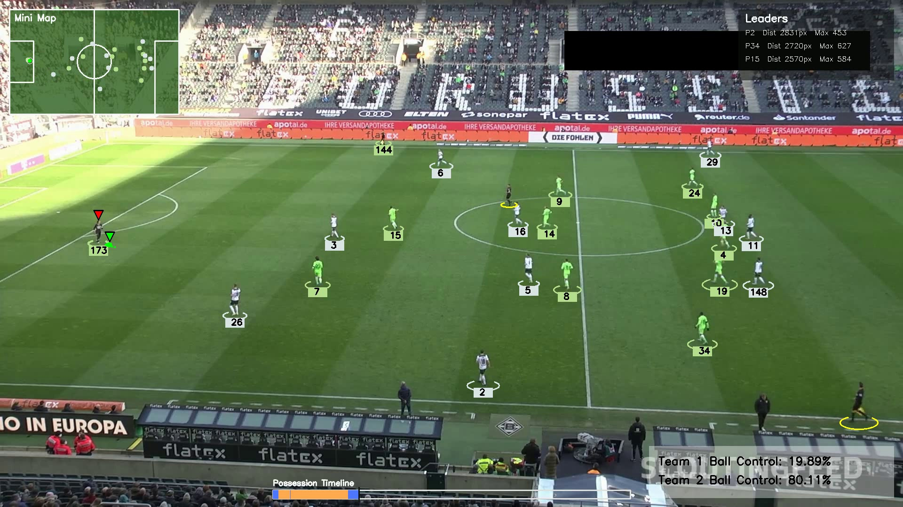
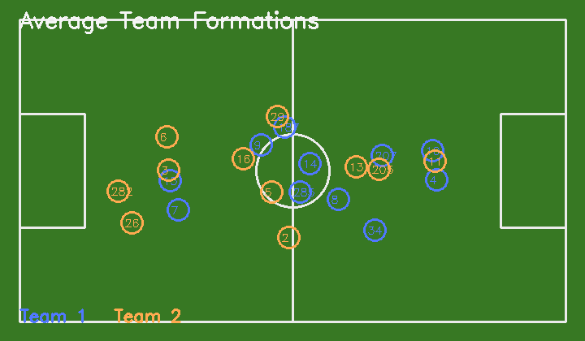
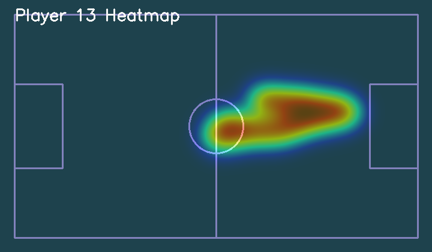

# Football Analysis

A computer-vision football analytics project that tracks players, estimates team possession, assigns teams by jersey color, and renders an annotated match video with tactical-style overlays and exported analytics artifacts.

## Demo

Run from the project root:

```bash
pip install -r requirements.txt
python main.py --read-from-stub
```

Open the generated results:

```bash
start output_videos\output_video.avi
start output_videos\team_formations.png
start output_videos\heatmaps
```

To run fresh detection instead of cached tracks:

```bash
python main.py --no-read-from-stub
```

## Screenshots

### Annotated Match Output



### Team Formations Export



### Player Heatmap Export



## Features

- Player, referee, and ball tracking
- Team assignment using jersey-color clustering
- Ball possession estimation per frame
- Annotated output video with:
  - live mini-map
  - ball trail
  - possession percentage panel
  - possession timeline
  - top-movers leaderboard
- Match summary export as JSON and CSV
- Team formations image export
- Player and team heatmap exports

## Output Files

The pipeline writes generated results to `output_videos/`, including:

- `output_video.avi`
- `match_summary.json`
- `player_stats.csv`
- `team_formations.png`
- `heatmaps/`

## Project Structure

- `main.py`: pipeline entry point and CLI options
- `trackers/`: tracking logic and video overlays
- `team_assigner/`: team-color clustering and team assignment
- `player_ball_assigner/`: ball-to-player possession logic
- `utils/`: video helpers, analytics summaries, heatmap exports

## Requirements

- Python 3.10+
- OpenCV
- NumPy
- pandas
- scikit-learn
- Ultralytics YOLO
- supervision

Install with:

```bash
pip install -r requirements.txt
```

## Notes

- Large local assets such as models, raw videos, training data, generated outputs, and stub files are intentionally ignored in Git for a cleaner public repository.
- To run the full pipeline without stubs, provide the required model and input video assets locally.
